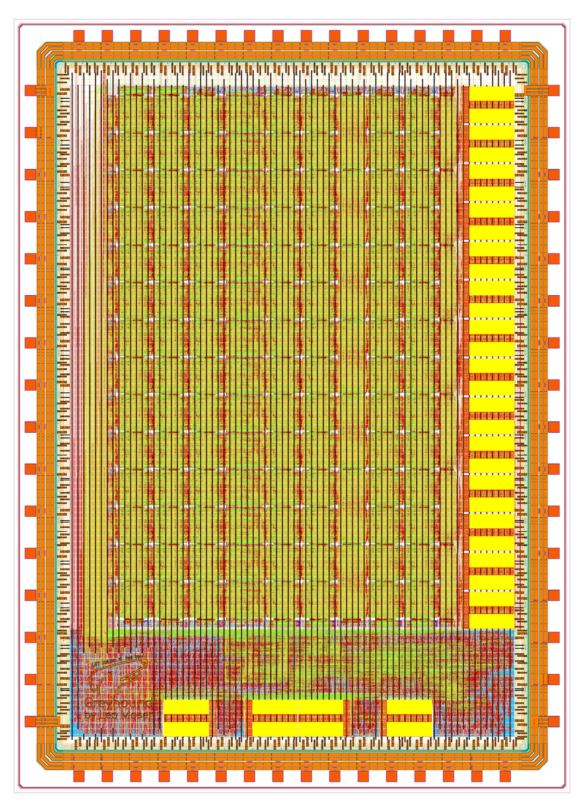
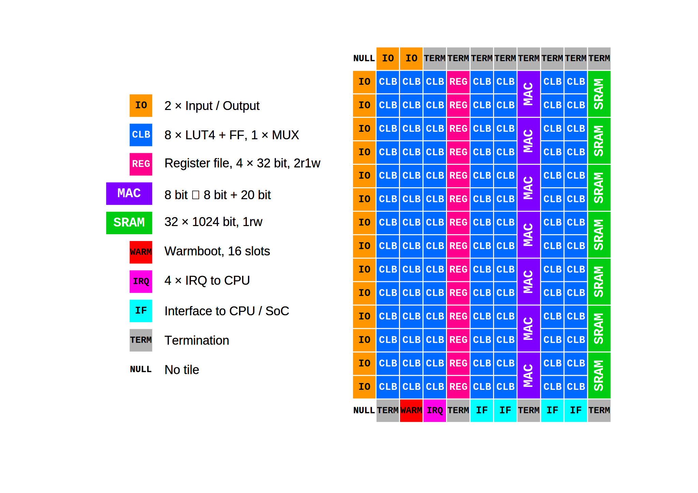
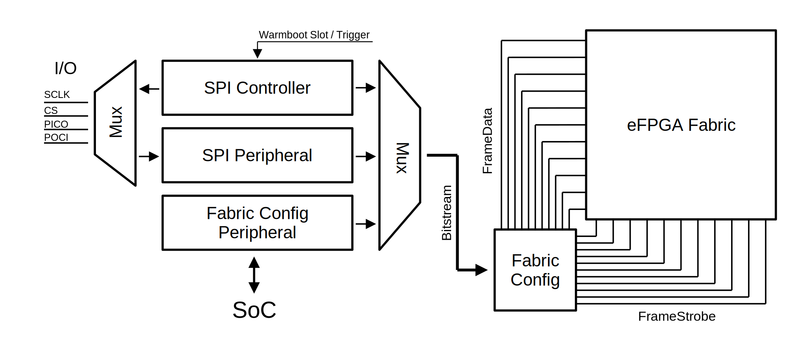

# Greyhound: A RISC-V SoC with tightly coupled eFPGA on IHP SG13G2

Greyhound's embedded FPGA can be used as a custom instruction extension, as a peripheral or as a completely standalone FPGA with 32 I/Os. Custom tiles were created to enable warmboot functionality and allow communication with the SoC. Thanks to FABulous, the user bitstream for the FPGA can be generated using the upstream yosys and nextpnr toolchain.

Greyhound was designed with open source EDA tools and the [IHP Open Source PDK](https://github.com/IHP-GmbH/IHP-Open-PDK).

<p align="center">
  <a href="img/greyhound_ihp_top.png">
    
  </a>
</p>

## Feature Overview

- SoC
  - [CV32E40X](https://github.com/openhwgroup/cv32e40x) RISC-V core from the OpenHW group
    - RV32IMA
    - Zca_Zcb_Zcmp_Zcmt (code-size reduction)
    - ZBA_ZBB_ZBC_ZBS (bit manipulation)
    - and more...
  - 8kB SRAM
  - QSPI Flash Controller for XIP
    - Cache: 8 lines of 32 bytes, direct mapped
  - QSPI PSRAM controller
  - Highly Configurable UART
  - Fabric Config Peripheral
  - Fabric Peripheral
- [FABulous](https://github.com/FPGA-Research/FABulous) eFPGA
  - 32x I/Os
  - 784x LUT4 + FF
    - w. carry chain
  - 98x MUX
    - Either 1xMUX8, 2xMUX4 or 4xMUX2
  - 7x SRAM
    - 32 bit-wide, 4kB deep
    - individual bit-enable
  - 7x MAC
    - 8bit*8bit + 20bit
    - sign-extend
    - sync/async operands and/or ACC
  - 14x Register file
    - 32x4bit each
    - 1w1r1r
    - sync/async output
  - 1x Global clock network
  - 1x WARMBOOT
    - Trigger a reconfiguration from one of 16 slots
    - Provides a reset signal which is asserted during reconfiguration
  - 1x CPU_IRQ
    - 4x Interrupt request lines to the CPU
  - 4x CPU_IF
    - Interface to the CPU/SoC
    - Custom instruction extension or peripheral

The FPGA can configure itself from an SPI Flash from any of 16 different slots, or receive the bitsream via SPI. The CPU can also trigger a reconfiguration or provide the bitstream directly.

Here are the STA results after PnR for the SoC:

| corner              | frequency |
|---------------------|-----------|
| nom_fast_1p32V_m40C | 85 MHz    |
| nom_typ_1p20V_25C   | 55 MHz    |
| nom_slow_1p08V_125C | 34 MHz    |

## FPGA Fabric

This is the tile map of the FPGA fabric:



## Memory Map

This is the memory map of the SoC:

| Base Address | Name               | Description                                                                                      |
|--------------|--------------------|--------------------------------------------------------------------------------------------------|
| 0x00000000   | FLASH_BASE         | QSPI XIP Flash controller with 8 lines of 32 bytes direct mapped cache                           |
| 0x10000000   | SRAM_BASE          | 8kB of SRAM                                                                                      |
| 0x20000000   | PSRAM_BASE         | QSPI PSRAM controller                                                                            |
| 0x30000000   | UART0_BASE         | Highly configurable UART with 16-byte TX and RX FIFO, 16-bit prescaler and ten interrupt sources |
| 0x40000000   | FABRIC_CONFIG_BASE | Fabric configuration peripheral                                                                  |
| 0x50000000   | FABRIC_BASE        | Interface to the fabric when it is configured as peripheral                                      |

## Fabric Config Peripheral

The `FABRIC_CONFIG` peripheral can be accessed by the CPU to configure the FPGA fabric and get its status.

| Offset | Register               | Description                                                                                                    |
|--------|------------------------|----------------------------------------------------------------------------------------------------------------|
| 0x0    | `REG_XIF_OR_PERIPH`      | [W] Write a 0 or 1. Sets the interface to the fabric as custom instruction interface (0) or as peripheral (1). |
| 0x4    | `REG_FABRIC_CONFIG_BUSY` | [R] Readonly. Returns 1 if the fabric is under configuration, 0 if not.                                        |
| 0x8    | `REG_BITSTREAM`          | [W] Write bitstream data to this register.                                                                     |
| 0xC    | `REG_TRIGGER_SLOT`       | [W] Trigger a reconfiguration by writing the slot to this register (0-15).                                     |

## Fabric Peripheral

The fabric peripheral can be accessed when `REG_XIF_OR_PERIPH` is set to 1. In this case the fabric will be interfaced as a peripheral. It is the responsibility of the user to upload a bitstream that correctly handles bus requests.

## Custom Instruction Extension

The fabric can implement a custom instruction which can be accessed by the CPU when `REG_XIF_OR_PERIPH` is set to 0.

The interface to the fabric is kept simple: the fabric receives the two operands and returns the result. To process more complicated instructions it is possible to specify after how many cycles the result is ready.

The custom instruction extension implements the `0x5B` opcode that is free to use. The instruction encoding is R-type: `.insn r opcode7, func3, func7, rd, rs1, rs2`. `func7` specifies the number of cycles after which the result is read.

You can easily execute a custom instruction directly from your C code using the `.insn` pseudo directive in GCC:

```C
int a=42; int b=3; int c;

// Read the result after 13 cycles
__asm__ volatile (".insn r 0x5b, 0, 13, %0, %1, %2" : "=r" (c) : "r" (a), "r" (b));
```

Where `a` and `b` are the variables for the operands and `c` is the variable for the result.

## FPGA Configuration

There are several paths for uploading a bitstream into the FPGA fabric.



1. Fabric config acts as controller (`fpga_mode` == 0)

The fabric config acts as a controller and loads a bitstream from an external SPI flash upon startup.

In this mode the `WARMBOOT` tile can trigger a reconfiguration from a different slot of the external SPI flash. In total there are 16 different slots to choose from. One slot is 0x4000 bytes large, where 0x3A88 bytes of those are actual bitstream data that is loaded.

2. Fabric config acts as peripheral (`fpga_mode` == 1)

In this mode the fabric config acts as a peripheral. You'll need to supply the bitstream in big-endian order via an external SPI controller.

3. CPU triggers a reconfiguration

By writing the slot number to the `REG_TRIGGER_SLOT` register of the `FABRIC_CONFIG` peripheral, the CPU triggers a reconfiguration of the FPGA. This means the fabric config loads the bitstream from an external SPI flash (`fpga_mode` must be 0).

4. CPU writes bitstream

The CPU can also write raw bitstream data to the `REG_BITSTREAM` register of the `FABRIC_CONFIG_BASE` peripheral. The advantage of this mode is that only one SPI flash needs to be populated on the PCB.

Approximate times for configuration from simulation:

- CPU configures FPGA @50MHz: ~13.3ms
- Fabric config controller @50MHz: ~5ms
- Fabric config peripheral @10Mhz: ~22.5ms

## Firmware and Bitstream

Example programs are under the `firmware/` directory. These include programs to use the UART, load a bitstream, trigger a bitstream reconfiguration, use a custom instruction of the fabric or access a peripheral of the fabric.

Instructions to compile a bitstream for the eFPGA can be found in the [`ip/fabulous_fabric`](https://github.com/mole99/fabulous_fabric) submodule.

## Simulation

Testbenches are using [cocotb](https://github.com/cocotb/cocotb). There are separate testbenches just for simulating the SoC or the full chip. To simulate the SoC, take a look at `tb/greyhound_soc_tb`. For the full chip simulation see `tb/greyhound_ihp_top`.

To start the full chip simulation simply run:

```
python3 greyhound_ihp_top_tb.py
```

To run a gate level simulation, simply set `GL`:

```
GL=1 python3 greyhound_ihp_top_tb.py
```

To select a different test, open `greyhound_ihp_top_tb.py` and set `enabled` to one of the available tests. This is unfortunately necessary since cocotb cannot restart the simulator between test runs.

## Building the Chip

> [!NOTE]
> Greyhound currently relies on forks of [OpenLane 2](https://github.com/mole99/openlane2/tree/greyhound) and the [IHP Open PDK](https://github.com/mole99/IHP-Open-PDK/tree/openlane) since some changes were necessary. I'm planning to upstream all changes to the upstream repositories soon.

To build the chip with OpenLane:

```console
openlane --manual-pdk config.yaml
```

Note: You need to export `PDK_ROOT` and `PDK` to the path of the IHP Open PDK and the name of the PDK.

The final steps:

```
make copy-final
make extract
make edit-netlists
make lvs
make insert-logo
make create-image
make fill
make drc
make zip
```

And with this Greyhound is ready for tapeout. 

## License

Greyhound is licensed under the Apache 2.0 license. This license may *not* apply to the remainder of the repository.